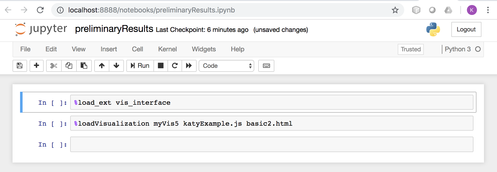
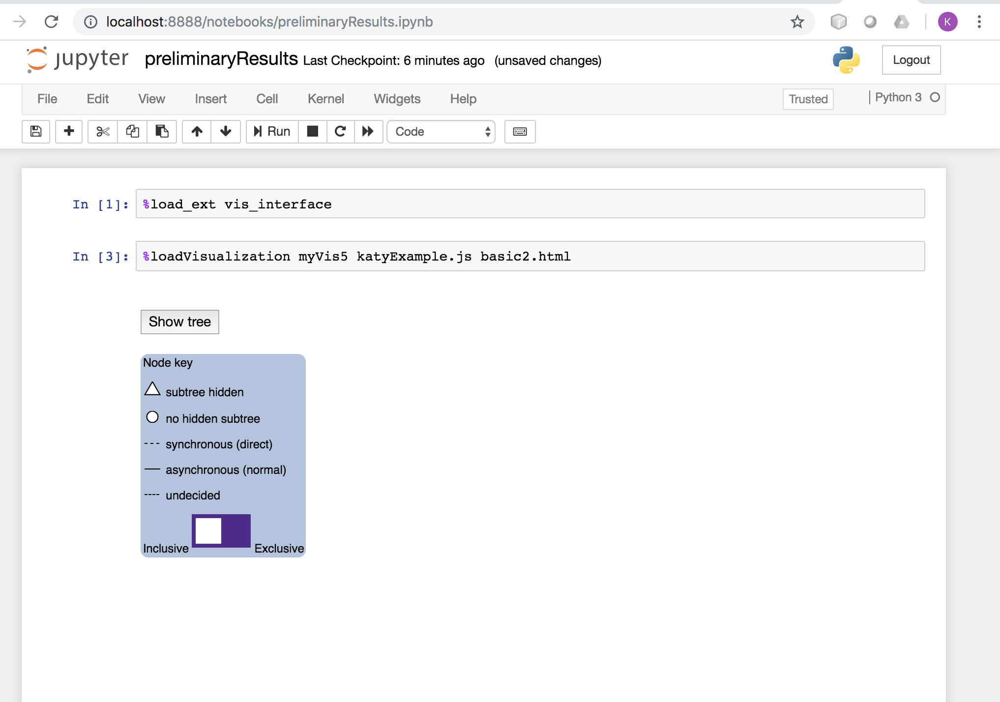
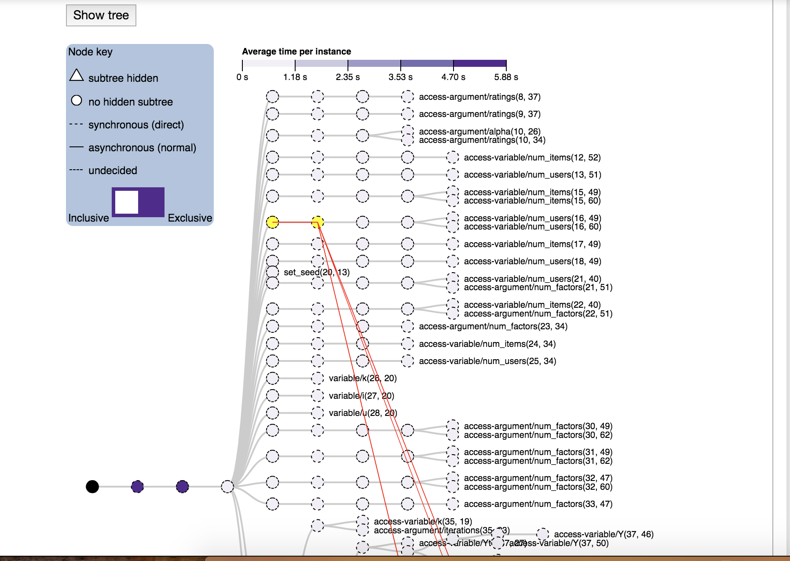

# Working version of Jupyter notebook + Katy's vis

Thank you to Jesse for getting d3 and JavaScript to play nicely with Jupyter notebooks!

**Instructions**

Clone the repository `expression-trees` and switch to the branch called `jupyter-versions`.


To run the notebook, enter the command prompt: 
```
jupyter-notebook preliminaryResults.ipynb 
```

The following Jupyter notebook should appear in your browser:




Execute each cell in the notebook one by one (use SHIFT + ENTER). After executing both cells, you should see:




*If you don't see the "Show tree" button, try executing the cell a couple more times (< 3 times). If it still doesn't appear, slightly widen or compress your browser window, it should appear.*


Hit the "Show tree" button and you should see (the red lines and highlighted node happen when you hover over a node):


