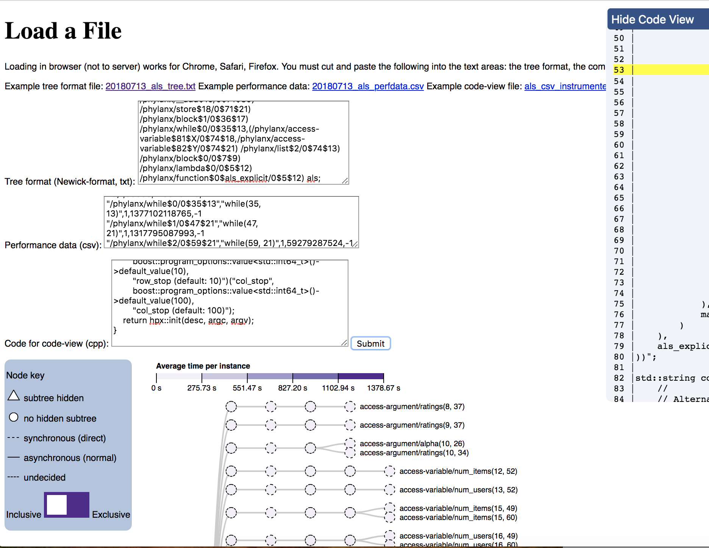

# expression-trees
Generating d3 expression tree visualizations with Newick-formatted trees.

# To use

Pull this repo and navigate to the `offline-tree` branch. To show the visualization, open your browser and enter the path to the file:
```
file:///Users/katywilliams/GitHub/expression-trees/upload_textarea.html
```
The input fields are text areas, instead of file uploads (I was running into issues when I tried to load and use multiple files at the same time). Copy and paste what would be the contents of the files into the corresponding fields (paste the tree format into the corresponding box, the comma-separated performance data into the correct box, and whatever code you want to view into the code view box). Don't worry that the text boxes appear to be one column tall - if you click and drag the little hash marks in the corner, you can expand the box (but that isn't necessary for the copy-pasting). See the image below for an idea of what to expect.



The offline version has been tested and works in Chrome, Safari, and Firefox.


# To gather the performance data and tree format

Note: the tree data and performance data do not need to be saved to specific files when using the offline version, since the
HTML page takes text input. These instructions below are to aid in parsing the output (and are artifacts of previous README's).

First I moved the dataset `MovieLens.csv` to `phylanx/build/bin`. Then I ran the following:
```
srun -n 1 ./als_csv_instrumented --data_csv=MovieLens.csv -i -t2 > myOutputFile
```

Once the run is completed, open `myOutputFile`. The tree information is under "Tree information for function: __ " (in this case, "Tree information for function: als"). It's Newick-formatted so there should be an abundance of parentheses. Copy from the start of the parentheses to the end, signaled by the function name and a semicolon. Paste this tree into a plain text file and save the file as a `.txt` file (e.g. "tree.txt"). Ignore the graph data labeled `graph "als" {`.

The performance data is titled "Primitive Performance Counter Data in CSV". Copy everything from the column names (`primitive_instance` .. `eval_direct`) until the final row. Paste this csv data into file and save the file as a `.csv` file (e.g. "perf_dat.csv"). All other information in the output is unnecessary for the visualization.

Commit HPX: 5171fb3

Commit Phylanx: 60d9099


# ALS Example
In `static` are the test files that I used. The performance data is stored in `20180713_als_perfdata.csv`. The tree structure is stored in `20180713_als_tree.txt`. The algorithm file is `als_csv_instrumented.cpp`. You can copy and paste the contents of these files into the input text areas of `upload_textarea.html` to test the webpage.

# Known issues
The red line that connects declarations of variables to the use of the variable is not currently in this version. The collapsing-by-line (the feature that made the tree shorter and have triangle nodes) was causing the whole tree to collapse into two nodes so I removed that function (i.e. the tree that appears is the whole tree, there aren't any hidden subtrees). The code view lines might be slightly off but they generally put you in the right spot.


