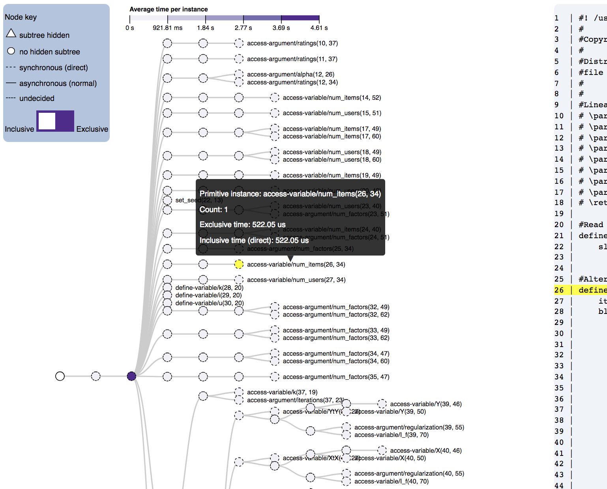
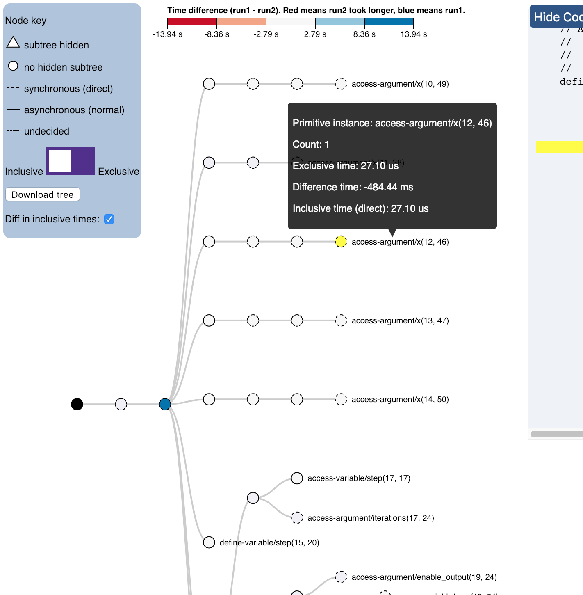

# expression-trees
Generating d3 expression tree visualizations with Newick-formatted trees.

Reingold-Tilford tree (viewing a single program run):


Reingold-Tilford comparison tree (colors denote time differences between two program runs):


# To use
You will need [Flask](http://flask.pocoo.org/) installed in order to host the web pages for the visualizations. 

To install Flask to work with Python 3 and 2, do:
```
pip3 install flask
```

This Flask application follows the typical format with a Python file that establishes the browser and hosts the webpages, a `static` folder that holds the data about the trees (as well as `style.css`, `d3.v4.js`, and `d3-tip.js`), and the `templates` folder that holds the HTML files with the Javascript that display the data. 

To use, first save the Newick-formatted tree into a text file and the performance data into a csv. 
Be sure that the column headers ("count", "time", etc.) are the first line of the csv. **Put the text file and csv file into the `static` folder.** Also copy the algorithm `.cpp` file into the `static` folder. To run the program, enter `python tree.py static/myperformancedata.csv static/mynewicktree.txt static/myalg_csv_instrumented.cpp` into the command line. 
**IMPORTANT: for the Flask application to host your data/tree properly, all tree, performance, and codeview files must be under the `static` folder.**

Note: `tree.py` is compatible with both Python 2 and 3.

# To gather the performance data and tree format
First I moved the dataset `MovieLens.csv` to `phylanx/build/bin`. Then I ran the following:
```
srun -n 1 ./als_csv_instrumented --data_csv=MovieLens.csv --instrumented -t2 > myOutputFile
```

Once the run is completed, open `myOutputFile`. The tree information is under "Tree information for function: __ " (in this case, "Tree information for function: als"). It's Newick-formatted so there should be an abundance of parentheses. Copy from the start of the parentheses to the end, signaled by the function name and a semicolon (e.g `) als;`). 
Paste this tree into a plain text file and save the file as a `.txt` file (e.g. "tree.txt"). 
Ignore the graph data labeled `graph "als" {`.

The performance data is titled "Primitive Performance Counter Data in CSV". Copy everything from the column names (`primitive_instance,` .. `eval_direct`) until the final row. Paste this csv data into file and save the file as a `.csv` file (e.g. "perf_dat.csv"). All other information in the output is unnecessary for the visualization.

Commit HPX: f4ead18

Commit Phylanx: b0d3712


# Single-tree Example
In `static` are the test files that I used. The performance data is stored in `20180713_als_perfdata.csv`. The tree structure is stored in `20180713_als_tree.txt`. The algorithm file is `als_csv_instrumented.cpp`. The full command: `python tree.py static/20180713_als_tree.txt static/20180713_als_perfdata.csv static/als_csv_instrumented.cpp`. If things run properly, you should see 
```
* Running on http://0.0.0.0:8001/ (Press CTRL+C to quit)
* Restarting with stat
127.0.0.1 - - [29/Jun/2018 16:16:45] "GET /codeview HTTP/1.1" 200 -
127.0.0.1 - - [29/Jun/2018 16:16:45] "GET /codeview HTTP/1.1" 200 -
```
and see the tree by clicking `Reingold-Tilford tree (one performance run)` at the top of the page at http://0.0.0.0:8001/ (or navigating to http://0.0.0.0:8001/rt_tree2).

# Comparison (two tree) Example
In `static` are the test files that I used. The performance data is stored in `20180713_als_perfdata.csv`. The tree structure is stored in `20180713_als_tree.txt`. The algorithm file is `als_csv_instrumented.cpp`. 
Please enter files in grouped pairs (e.g. "tree1 tree2 data1 data2 codefile" or "tree1 data1 tree2 data2 codefile"). The full command: 
```python tree.py static/20180713_als_tree.txt static/20180713_als_perfdata.csv static/20180625_treeformat_alsmovie.txt static/20180625_perfdata_alsmovie.csv static/als_csv_instrumented.cpp```.

If things run properly, you should see 
```
* Running on http://0.0.0.0:8001/ (Press CTRL+C to quit)
* Restarting with stat
127.0.0.1 - - [29/Jun/2018 16:16:45] "GET /codeview HTTP/1.1" 200 -
127.0.0.1 - - [29/Jun/2018 16:16:45] "GET /codeview HTTP/1.1" 200 -
```
and see the tree by clicking `Compare two Reingold-Tilford trees (two performance runs)` at the top of the page at http://0.0.0.0:8001/ (or navigating to http://0.0.0.0:8001/compare).


