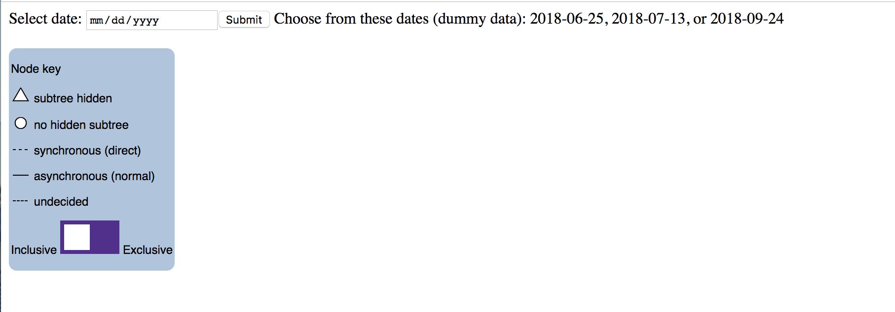
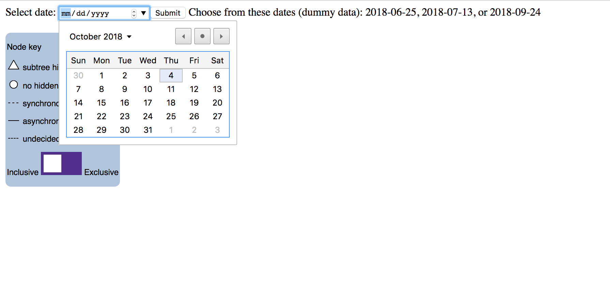
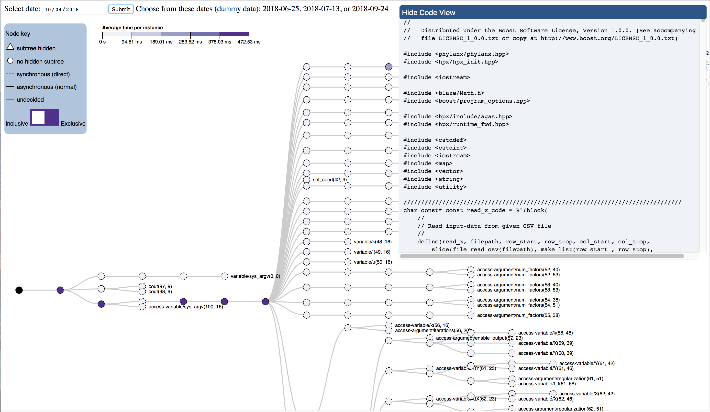

# oregon-test

To gather the data, I used the following when running als:
```
./physl als.physl \"MovieLens.csv\" 10 100 0.1 10 1 40 0 --performance --dump-newick-tree=2018-10-02-tree.txt --dump-counters=2018-10-02-performance.csv
```
or 
```
srun -n 1 ./physl als.physl \"MovieLens.csv\" 10 100 0.1 10 1 40 0 --performance --dump-newick-tree=2018-10-04-tree.txt --dump-counters=2018-10-04-performance.csv
```

I'm not sure how you run the nightly tests but the important things (that I've learned through trial-and-error) are:
- Include \ and " around the data csv name
- The arguments `10 100 0.1 10 1 40 0` are necessary
- You __must__ include the `--performance` flag when adding any of the `--dump-` flags

For the trees to show up:
- Use `--dump-newick-tree` and `--dump-counters`
- The filenames for this output should be `data/<today's date>-tree.txt` and `data/<today's data>-performance.csv`
  - The date should be formatted `yyyy-mm-dd` (this allows the user to select a date)

If a day's data is correctly labeled `yyyy-mm-dd-tree.txt` and `yyyy-mm-dd-performance.csv` and stored in `data/`,
then when you go to daily-tree.html, that tree should be able to be displayed.
  
Initial load page:


Selecting a date (2018-10-04 works):


The final loaded image:

